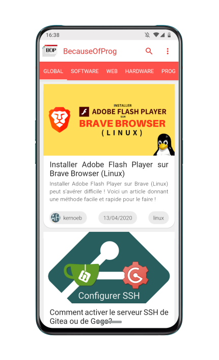

<div align="center">
  <div style="display: flex">
    
    <h1>BecauseOfProg's mobile app</h1>
  </div>
  <h3>The fastest way to read articles from the team</h3>
  <a href="./LICENSE">
    
  </a>
</div>

- [📥 Get the app](#-get-the-app)
- [🌈 How it works](#-how-it-works)
- [💻 Development](#-development)
  - [Prerequisites](#-prerequisites)
  - [Setup](#setup)
- [📜 Credits](#-credits)
- [🔐 License](#-license)

## 📥 Get the app

TODO

## 🌈 How it works

It's a React Native app

## 💻 Development

### Prerequisites

- react-native 0.62.x  
- Android Studio (or Android SDK)

### Setup

##### Fast refresh mode (development mode)

```bash
npx npm run android
npx npm run start
``` 

##### Build bundle

- Cli

`react-native bundle --platform android --dev false --entry-file index.js --bundle-output android/app/src/main/assets/index.android.bundle --assets-dest android/app/src/main/res"`

- Android Studio

    1. Build (top menu)
    2. Generate (Signed) Bundle/APK 
    3. Choose Android App Bundle

##### Build apk

- Cli

`cd android && ./gradlew clean && ./gradlew app:assembleRelease`

- Android Studio

    1. Build (top menu)
    2. Generate (Signed) Bundle/APK 
    3. Choose APK

## 📜 Credits

- Maintainer: [kernoeb](https://github.com/kernoeb)
- Special thanks to :
  - [Gildas GH](https://github.com/Gildas-GH) (BecauseOfProg)
  - [exybore](https://github.com/exybore) (BecauseOfProg)
  - [Whaxion](https://github.com/whaxion) (BecauseOfProg)
  - [Selim](https://github.com/selimgr)

## 🔐 License

GNU GPL v3. See [license file](./LICENSE)
